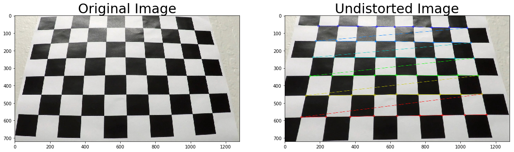
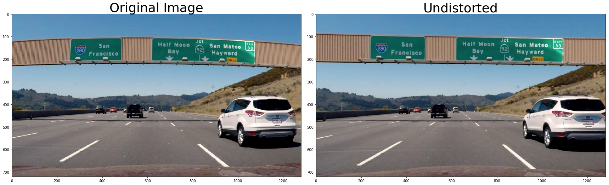
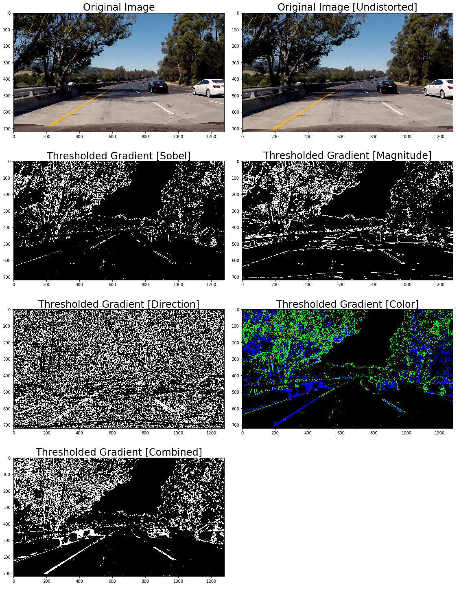
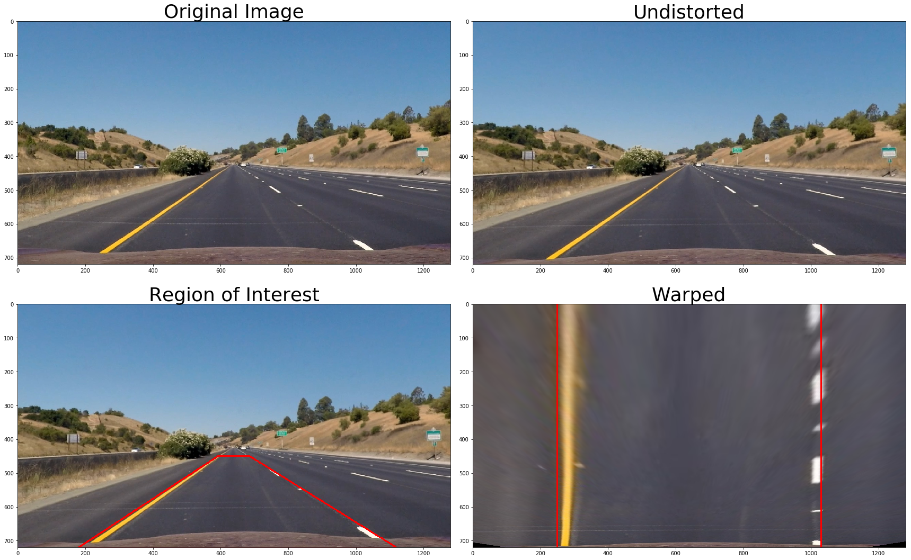
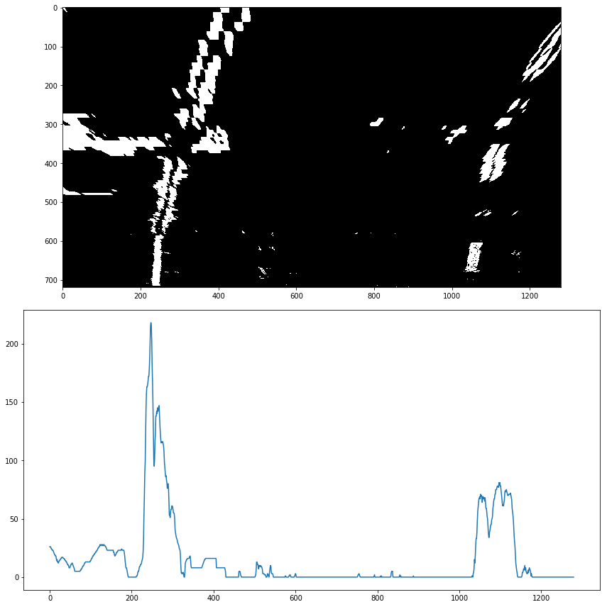
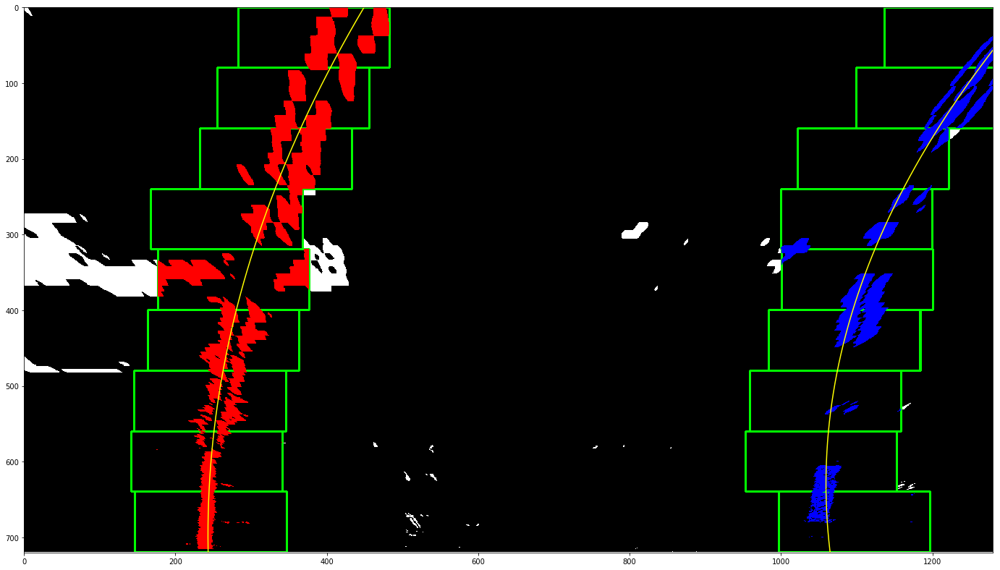
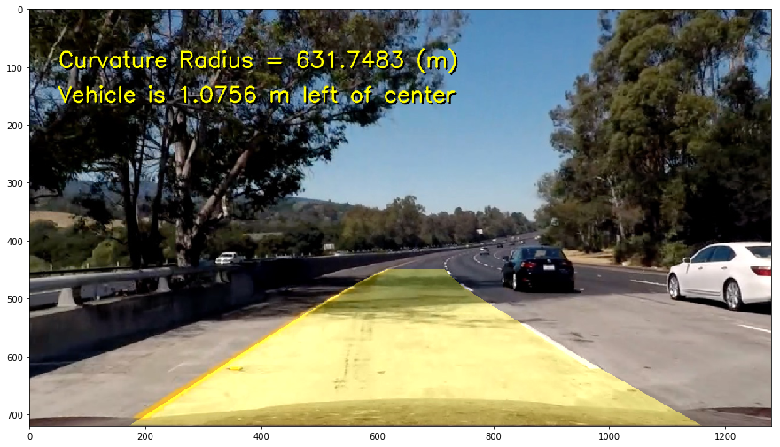

## Project 5 Writeup: Advanced Lane Finding


**by Patrick Poon**

---

**Advanced Lane Finding Project**

The goals / steps of this project are the following:

* Compute the camera calibration matrix and distortion coefficients given a set of chessboard images.
* Apply a distortion correction to raw images.
* Use color transforms, gradients, etc., to create a thresholded binary image.
* Apply a perspective transform to rectify binary image ("birds-eye view").
* Detect lane pixels and fit to find the lane boundary.
* Determine the curvature of the lane and vehicle position with respect to center.
* Warp the detected lane boundaries back onto the original image.
* Output visual display of the lane boundaries and numerical estimation of lane curvature and vehicle position.

## Rubric Points
### Here I will consider the [rubric points](https://review.udacity.com/#!/rubrics/571/view) individually and describe how I addressed each point in my implementation.  

---
### Writeup / README

#### 1. Provide a Writeup / README that includes all the rubric points and how you addressed each one.  You can submit your writeup as markdown or pdf.  [Here](https://github.com/udacity/CarND-Advanced-Lane-Lines/blob/master/writeup_template.md) is a template writeup for this project you can use as a guide and a starting point.  


The write-up and README file were created with the Jupyter Notebook input cells folded.  To see the code used to generate the images, please refer to the **`writeup_worksheet.ipyb`** file in which the input cells are expanded.

### Camera Calibration

#### 1. Briefly state how you computed the camera matrix and distortion coefficients. Provide an example of a distortion corrected calibration image.

The code for this step is in the **`get_calibration_pts`** function in lines 17-47 in the file, **`calibrate_camera.py`**.

I start by preparing "object points", which represent the (x, y, z) coordinates of chessboard corners in virtual space. I assume the chessboard is fixed on the (x, y) plane at z=0, so that the object points are equivalent for each calibration image.  Thus, `objp` is just a replicated array of coordinates, and every time I successfully detect all chessboard corners in a test image, `objpoints` will be appended with a copy of it.  With each successful chessboard detection, `imgpoints` will be appended with the (x, y) pixel position of each of the corners in the image plane.  

At this point, I used the resulting `objpoints` and `imgpoints` arrays to compute the camera calibration and distortion coefficients using the `cv2.calibrateCamera()` function.  I then applied this distortion correction to a test image using the `cv2.undistort()` function and obtained the following result: 





### Pipeline (single images)

#### 1. Provide an example of a distortion-corrected image.

To ensure that my calibration results would work on the driving images, I tested the results against the `signs_vehicles_xygrad.png` image from the "Combining Thresholds" lesson in the "Advanced Lane Finding" module of the Udacity curriculum.  The file can be found in the `./test_images/` directory.

The image is quite distorted.  I loaded the calibration matrix and distortion coefficients, and fed them in the `cv2.undistort()` function along with the image in line 51 of the `calibrate_camera.py` file.  Here are the results:





The calibration results appear to be working effectively.

#### 2. Describe how (and identify where in your code) you used color transforms, gradients or other methods to create a thresholded binary image.  Provide an example of a binary image result.

I wrote functions to generate a variety of threshold binaries, namely absolute Sobel, directional, magnitude, and color, in lines 9 to 107 in **`thresholds.py`**.  Images of each threshold binary is shown below.  I found the combined color threshold to be the most effective in detecting the lane lines, even with a shadow obscuring a part of the lane.

Using `cv2.cvtColor` function to obtain the HLS (Hue, Lightness, and Saturation) values for the image, I was able to extract the Lightness and Saturation channels and use them with the `cv2.Sobel` operator to calculate a binary that effectively detects the lanes in lines 79-107 in `thresholds.py`.  Please see the **Thresholded Gradient [Combined]** image below for the result:




#### 3. Describe how (and identify where in your code) you performed a perspective transform and provide an example of a transformed image.

To perform a perspective transform on the road images, I used a function called `warper()`, which appears in lines 4 through 8 in the `warper.py` file (./warper.py).  The `warper()` function accepts an image (`image`), as well as source (`src`) and destination (`dst`) points as inputs.

I used the `./test_images/straight_lines1.jpg` as my source file.  With the GIMP image manipulation application, I determined the specific region of interest I would warp to detect the lanes.  I calibrated the points by warping the image and adjusting until the lines were vertically straight.  Here are the final source and destination points I chose:

| Source        | Destination   | 
|:-------------:|:-------------:| 
| 592, 450      | 250, 0        | 
| 686, 450      | 1030, 0       |
| 1120, 720     | 1030, 720     |
| 180, 720      | 250, 720      |


To confirm that my perspective transform succeeded, I printed the original image, undistorted it, drew lines between the region of interest `src` points, and finally warped the image to provide a "bird's eye" view, using the `dst` points:




#### 4. Describe how (and identify where in your code) you identified lane-line pixels and fit their positions with a polynomial?

Applying the warper() function to the `./test_images/test5.jpg` image, I get the warped image below.  I created a histogram of the bottom half of the image to determine a base point to start detecting lanes.  





I used NumPy's `argmax()` function to determine the peak points for the left and right halves of the image (please see lines 115-121 in `generate_video.py`).  I then slice the peak point region into nine windows in which I extract line pixel positions for each lane with the purpose of fitting a second order polynomial to each lane marker (lines 149-193 in `generate_video.py`).  The polynomials are fitted using NumPy's `polyfit()` function in lines 192-193.  Here is the result:





#### 5. Describe how (and identify where in your code) you calculated the radius of curvature of the lane and the position of the vehicle with respect to center.

With the polynomials calculated in the last step, I use them with the following conversion factors to calculate the radius of the left and right lane markers:
```
ym_per_pix = 30/720 # meters per pixel in y dimension
xm_per_pix = 3.7/700 # meters per pixel in x dimension
```
These calculations are done in lines 196-197 in `generate_video.py` for the left and right lane markers.  I then average them in line 211 to calculate an overall curvature radius in meters.  Calculation of the distance from the center is performed in lines 214-215, where I take the average point between the left and right base points and subtract the center of the image where the camera is situated.  The resulting value is converted to meters using the `xm_per_pix` conversion factor above.


#### 6. Provide an example image of your result plotted back down onto the road such that the lane area is identified clearly.

Using the second order polynomials above, I painted the region between the lanes onto a warped blank image.  This image is then warped back to the original image space using the inverse perspective matrix (`Minv`).  Finally, I annotate the image with the lane curvature radius and distance from center.  Please refer to lines 199-235 in `generate_video.py` for code details.  Here is the result:

---




### Pipeline (video)

#### 1. Provide a link to your final video output.  Your pipeline should perform reasonably well on the entire project video (wobbly lines are ok but no catastrophic failures that would cause the car to drive off the road!).

Here's a [link to my video result](https://youtu.be/W0xzcFRIw2g).  A copy of the movie file can be found at `./yellow_brick_road.mp4`.

---


### Discussion

#### 1. Briefly discuss any problems / issues you faced in your implementation of this project.  Where will your pipeline likely fail?  What could you do to make it more robust?

The main problem I encountered is when the road goes from dark to light asphalt.  My pipeline had difficulty detecting the lane due to low contrast between the lane markers and the road.  

My pipeline will likely fail in regions where there is low contrast between the lane markers and the road.  I could potentially make my pipeline more robust by testing a mix of threshold binaries that would perform better in detecting lanes in low contrast conditions.
